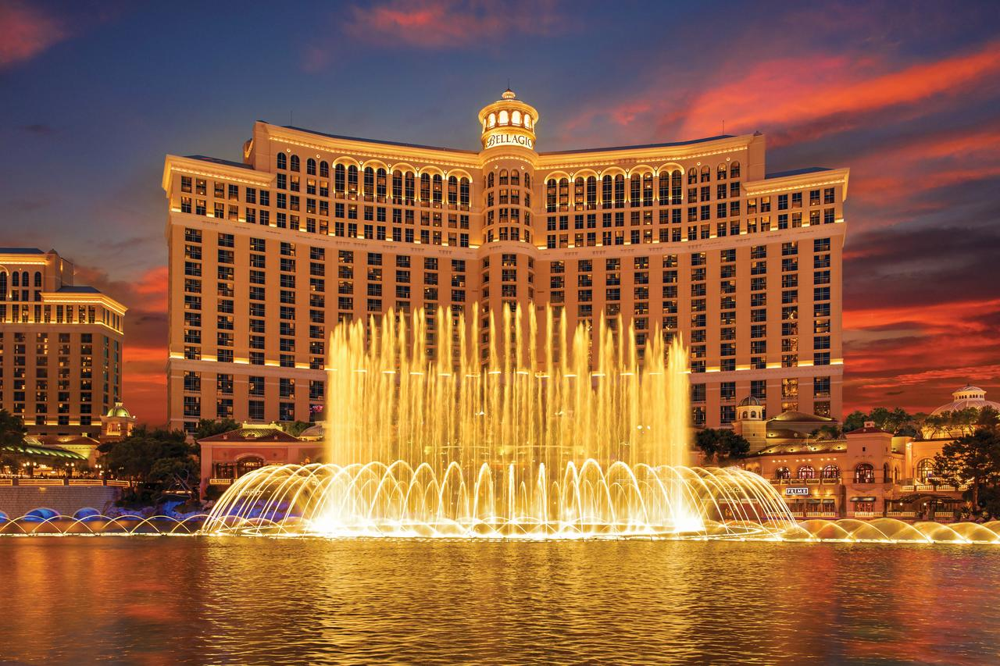
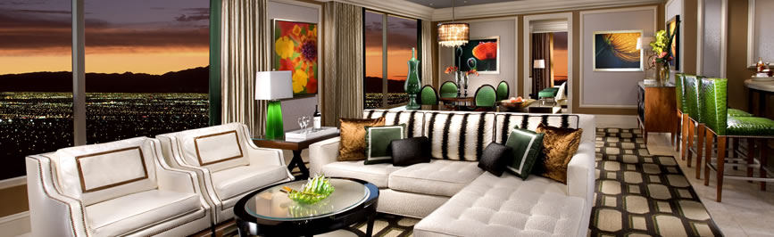

# Hotel Details

The hotel that we are staying at the weekend of February 23-25th is the [Bellagio in Las Vegas.](https://www.bellagio.com/en.html "Bellagio Homepage")

This is what the hotel looks like.

#### Room

As there are six of us, we have chosen to stay in **3 separate 2-Bedroom Penthouse Suite** rooms, where we can enjoy 3 separate living rooms that look like this:

The room assignments are as follows:
- Hayden and Jim in room 1
- Caleb and He in room 2
- Trevor and Tristin in room 3

#### Price

The price for one room for the weekend of February 23rd - 25th is below.

As there are 3 rooms, we multiply the reservation total by 3.

$2,334.38 * 3 = $7,003.14

This accounts for tax and the "Resort Fee" that we must pay.

#### Check in / out Details

In the fine print below the reservation total, the check in and out times are discussed (No images, that was really tiny)
- Check in time is 3:00 PM
- Check out time is 11:00 AM
